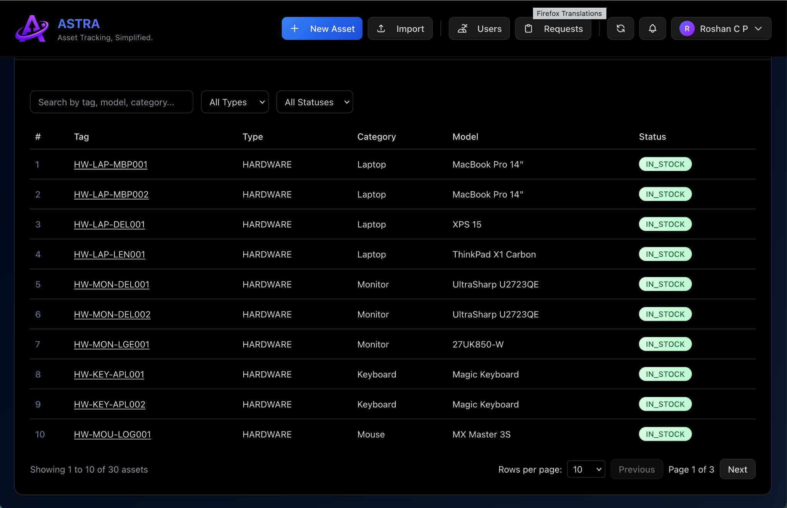
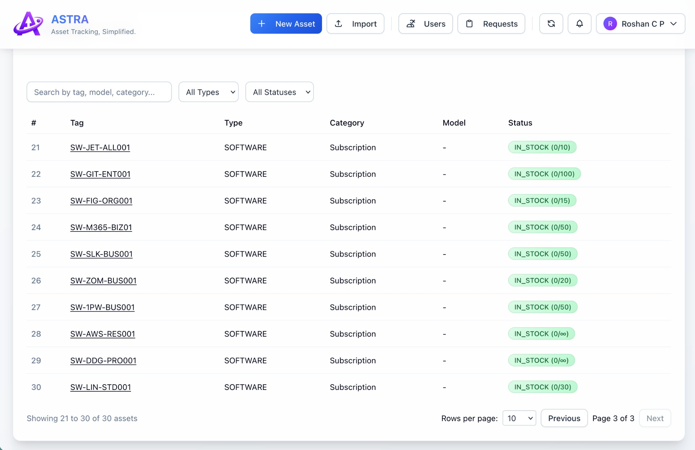
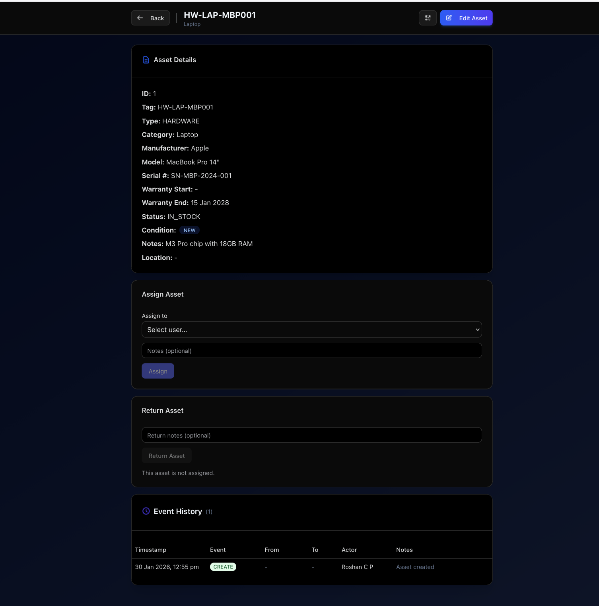
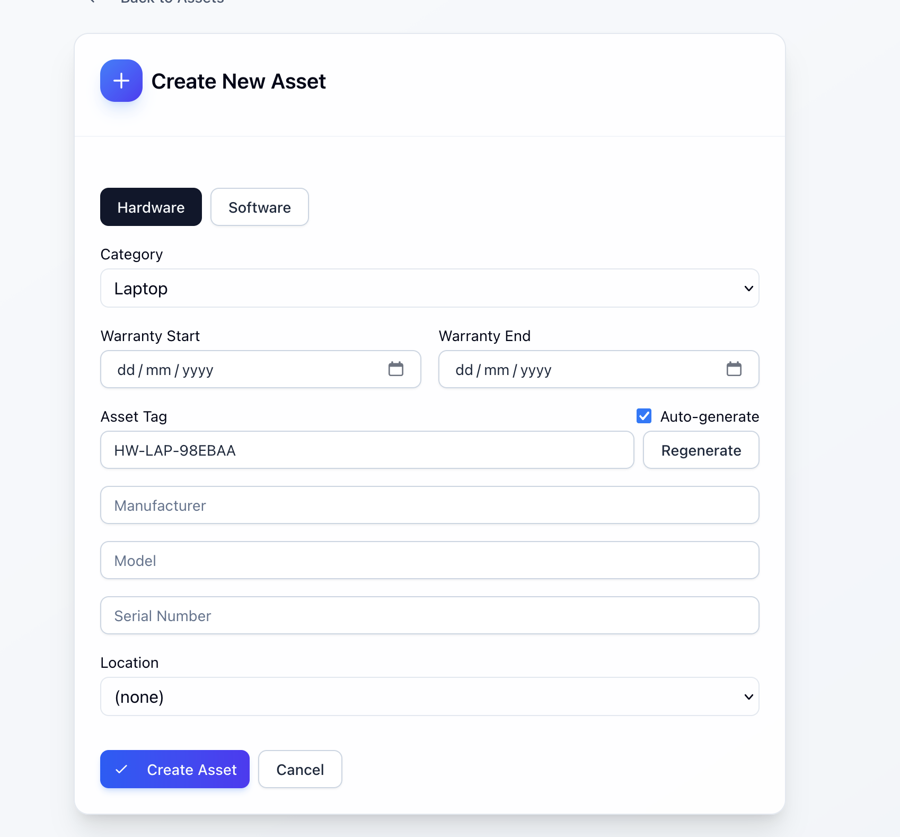
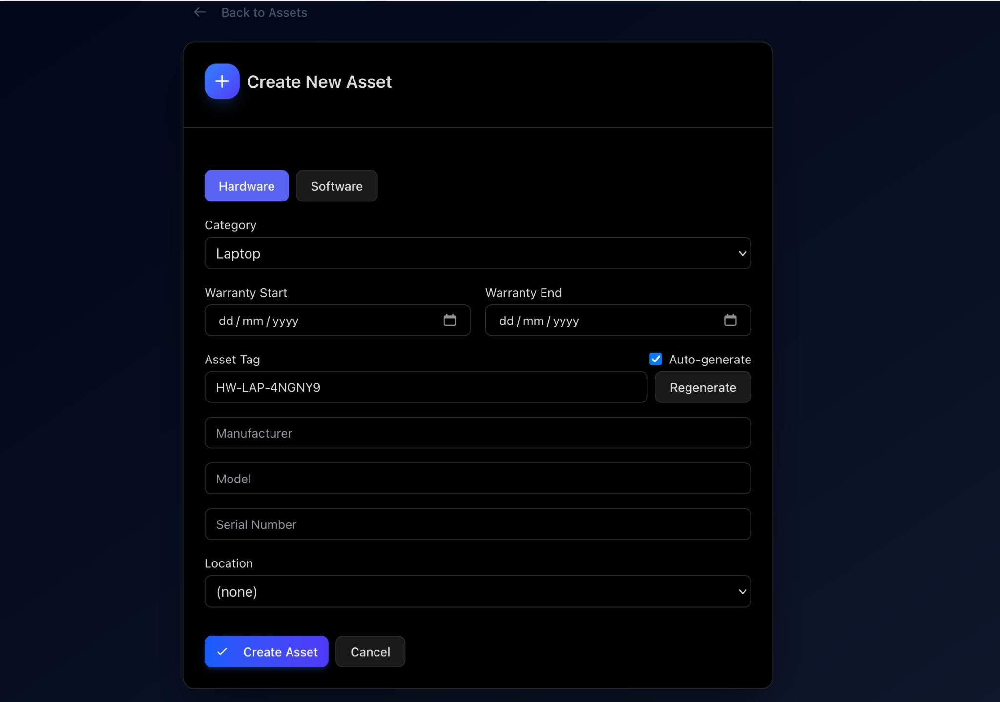
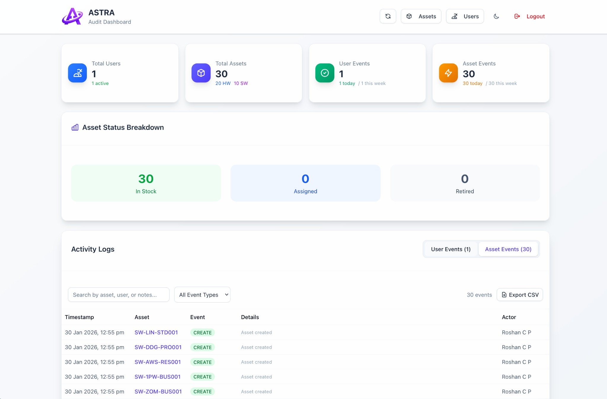
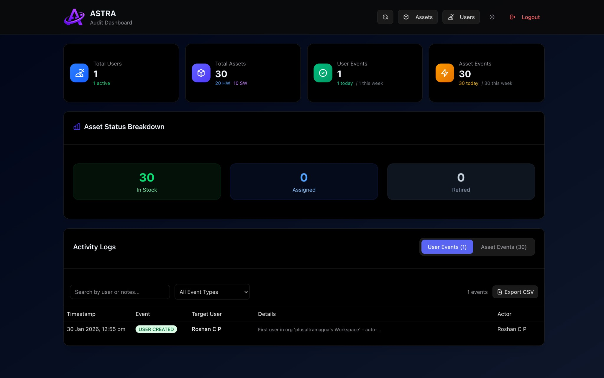

# ASTRA - Asset Tracking, Simplified.

A full-stack asset management application with multi-tenancy support, Google OAuth, and role-based access control.


## Live Demo

Try ASTRA without installing anything: **[astra-frontend-czrm.onrender.com](https://astra-frontend-czrm.onrender.com)**

Sign in with Google to create your own workspace. *(Free tier - may take ~30s to wake up if idle)*

---

## Table of Contents

- [Screenshots](#screenshots)
- [Features](#features)
- [Quick Start](#quick-start-one-command)
- [Google OAuth Setup](#google-oauth-setup)
- [Development Setup](#development-setup-manual)
- [Tech Stack](#tech-stack)
- [Multi-Tenancy](#multi-tenancy)
- [User Roles](#user-roles)
- [Project Structure](#project-structure)
- [Environment Variables](#environment-variables)
- [API Documentation](#api-documentation)
- [Self-Hosting](#self-hosting-for-your-company)
- [Deploy with Render](#alternative-deploy-with-render)
- [Sample Data](#sample-data)

---

## Screenshots

### Asset Dashboard
View and manage all your organization's assets with powerful search and filtering.

| Dark Mode | Light Mode |
|:---------:|:----------:|
|  |  |

### Asset Details
Detailed view of individual assets with full history and assignment management.

| Dark Mode | Light Mode |
|:---------:|:----------:|
|  |  |

### Create New Asset
Easily add hardware or software assets with auto-generated tags.

| Dark Mode | Light Mode |
|:---------:|:----------:|
|  |  |

### Audit Dashboard
Complete visibility into all user and asset activity with exportable logs.

| Dark Mode | Light Mode |
|:---------:|:----------:|
|  |  |

## Features

- **Multi-Tenancy**: Organizations are automatically created based on email domain. Each company sees only their own data.
- **Google OAuth**: Secure sign-in with Google accounts
- **Asset Tracking**: Manage hardware (laptops, monitors, phones) and software subscriptions
- **Seat Management**: Track software subscription seats with assign/return functionality
- **User Management**: Role-based access control (Admin, Manager, Employee, Auditor)
- **Invite System**: Admins can generate invite links to add team members
- **Bulk Import**: Import assets via CSV
- **QR Codes**: Generate QR codes for asset labels
- **Audit History**: Complete event log for all asset and user changes
- **Dark Mode**: AMOLED-optimized dark theme
- **Modern UI**: Clean, responsive interface with animations

## Quick Start (One Command)

### Prerequisites
- [Docker Desktop](https://www.docker.com/products/docker-desktop/)

### Run Everything

```bash
git clone https://github.com/yourusername/asset-management.git
cd asset-management
docker compose up
```

Open [http://localhost:3000](http://localhost:3000) and sign in with Google.

The first user from your email domain becomes the **Admin**. Subsequent users from the same domain join as **Employees**.

## Google OAuth Setup

To enable Google Sign-In, you need to create OAuth credentials:

1. Go to [Google Cloud Console](https://console.cloud.google.com/)
2. Create a new project or select existing
3. Go to **APIs & Services** → **Credentials**
4. Click **Create Credentials** → **OAuth 2.0 Client ID**
5. Set application type to **Web application**
6. Add authorized redirect URI: `http://localhost:8000/auth/google/callback`
7. Copy the Client ID and Client Secret

Add these to your `docker-compose.yml`:
```yaml
backend:
  environment:
    GOOGLE_CLIENT_ID: your-client-id
    GOOGLE_CLIENT_SECRET: your-client-secret
```

<details>
<summary><h2>Development Setup (Manual)</h2></summary>

If you prefer running services separately for development:

### 1. Start the database

```bash
docker compose up -d db
```

### 2. Start the backend

```bash
cd backend
cp .env.example .env  # Edit with your settings
uv sync
uv run alembic upgrade head
uv run uvicorn app.main:app --reload --port 8000
```

### 3. Start the frontend

```bash
cd frontend
npm install
npm run dev
```

### 4. Open the app

Visit [http://localhost:3000](http://localhost:3000)

</details>

## Tech Stack

| Layer | Technology |
|-------|------------|
| Frontend | Next.js 15, React, TypeScript, Tailwind CSS, shadcn/ui |
| Backend | FastAPI, SQLAlchemy, Pydantic |
| Database | PostgreSQL 16 |
| Auth | Google OAuth + JWT tokens |
| Container | Docker Compose |

## Multi-Tenancy

ASTRA supports multiple organizations in a single deployment:

| Scenario | What happens |
|----------|--------------|
| `alice@acme.com` signs in first | Creates "Acme Organization", becomes Admin |
| `bob@acme.com` signs in later | Joins "Acme Organization" as Employee |
| `carol@other.com` signs in | Creates "Other Organization", becomes Admin |
| `dave@gmail.com` signs in | Creates personal workspace |

Organizations are completely isolated - users can only see data from their own organization.

### Invite System

Admins can invite team members (especially useful for personal email users):

1. Go to **Users** page
2. Click **Invite Team**
3. Create an invite code
4. Share the link with your team member
5. They sign in and automatically join your organization

## User Roles

| Role | Permissions |
|------|-------------|
| **Admin** | Full access: manage assets, users, create invites |
| **Manager** | Manage assets (create, edit, assign), view all users |
| **Employee** | View and manage assigned assets only |
| **Auditor** | Read-only access to all data and audit logs |

## Project Structure

```
asset-management/
├── backend/
│   ├── app/
│   │   ├── routers/       # API endpoints
│   │   ├── models.py      # Database models (User, Asset, Organization)
│   │   ├── schemas.py     # Pydantic schemas
│   │   ├── crud.py        # Database operations
│   │   ├── auth.py        # JWT authentication
│   │   └── main.py        # FastAPI app
│   ├── migrations/        # Alembic migrations
│   └── Dockerfile
├── frontend/
│   ├── app/               # Next.js pages
│   ├── components/        # UI components
│   ├── lib/               # Utilities & API client
│   └── Dockerfile
└── docker-compose.yml     # Full stack deployment
```

## Environment Variables

### Backend
| Variable | Description | Default |
|----------|-------------|---------|
| `DATABASE_URL` | PostgreSQL connection string | (required) |
| `JWT_SECRET` | Secret key for JWT tokens | (required in production) |
| `GOOGLE_CLIENT_ID` | Google OAuth client ID | (required for OAuth) |
| `GOOGLE_CLIENT_SECRET` | Google OAuth secret | (required for OAuth) |
| `FRONTEND_URL` | Frontend URL for redirects | `http://localhost:3000` |

### Frontend
| Variable | Description | Default |
|----------|-------------|---------|
| `NEXT_PUBLIC_API_URL` | Backend API URL | `http://localhost:8000` |

## API Documentation

When the backend is running:
- Swagger UI: [http://localhost:8000/docs](http://localhost:8000/docs)
- ReDoc: [http://localhost:8000/redoc](http://localhost:8000/redoc)

<details>
<summary><h2>Self-Hosting for Your Company</h2></summary>

Want to run ASTRA for your company? Here's a complete guide to deploy it on your own server.

### Prerequisites

- A server (VPS or on-premise) with Docker installed
- A domain name (optional but recommended)
- Google Cloud account for OAuth

### Step 1: Set Up Your Server

Any Linux server with Docker works. Popular options:

| Provider | Cost | Notes |
|----------|------|-------|
| **Oracle Cloud** | **Free forever** | 2 VMs, 24GB RAM on ARM - best free option |
| **AWS EC2** | Free for 12 months | t2.micro, then ~$10/mo |
| **Hetzner** | €4/mo | Great value, EU-based |
| **DigitalOcean** | $6/mo | Easy to use |
| **Your own hardware** | Free | Old laptop, Raspberry Pi, etc. |

Install Docker on your server:
```bash
# Ubuntu/Debian
curl -fsSL https://get.docker.com | sh
sudo usermod -aG docker $USER
```

### Step 2: Clone the Repository

```bash
git clone https://github.com/RoshanCP-boop/asset-management.git
cd asset-management
```

### Step 3: Configure Google OAuth

1. Go to [Google Cloud Console](https://console.cloud.google.com/)
2. Create a new project
3. Go to **APIs & Services** → **OAuth consent screen**
   - Choose **External**
   - Fill in app name, support email
   - Add your domain to authorized domains
4. Go to **Credentials** → **Create Credentials** → **OAuth 2.0 Client ID**
   - Application type: **Web application**
   - Authorized redirect URI: `https://yourdomain.com/auth/google/callback`
   - (Or `http://your-server-ip:8000/auth/google/callback` if no domain)
5. Copy the **Client ID** and **Client Secret**

### Step 4: Configure Environment

Create a `.env` file in the backend folder:
```bash
cp backend/.env.example backend/.env
nano backend/.env
```

Add your credentials:
```env
DATABASE_URL=postgresql://asset_user:asset_pass@db:5432/asset_db
GOOGLE_CLIENT_ID=your-client-id-here
GOOGLE_CLIENT_SECRET=your-client-secret-here
JWT_SECRET=generate-a-long-random-string-here
FRONTEND_URL=https://yourdomain.com
```

Update `docker-compose.yml` if using a domain:
```yaml
backend:
  environment:
    FRONTEND_URL: https://yourdomain.com

frontend:
  environment:
    NEXT_PUBLIC_API_URL: https://yourdomain.com:8000
```

### Step 5: Start the Application

```bash
docker compose up -d
```

Your app is now running:
- Frontend: `http://your-server-ip:3000`
- Backend: `http://your-server-ip:8000`

### Step 6: Set Up Domain (Optional but Recommended)

**Don't have a domain?** Use a free subdomain:
- **DuckDNS** (free): Get `yourname.duckdns.org` at https://www.duckdns.org
- Just point it to your server IP and you're done

**Have your own domain?** Point your domain's DNS to your server IP.

Then set up a reverse proxy like Caddy for HTTPS:

**Using Caddy (easiest, auto-HTTPS):**
```bash
# Install Caddy
sudo apt install -y caddy

# Edit Caddy config
sudo nano /etc/caddy/Caddyfile
```

```
yourdomain.com {
    reverse_proxy localhost:3000
}

api.yourdomain.com {
    reverse_proxy localhost:8000
}
```

```bash
sudo systemctl restart caddy
```

### Step 7: First Login

1. Open your domain in a browser
2. Click **Sign in with Google**
3. The first person from your company domain becomes **Admin**
4. Invite your team from the **Users** page

</details>

<details>
<summary><h2>Alternative: Deploy with Render</h2></summary>

A `render.yaml` Blueprint file is included for quick deployment to [Render](https://render.com). This is useful for demos or testing, but not recommended for production.

1. Fork/clone the repo to your GitHub
2. Go to [Render Dashboard](https://dashboard.render.com) → **New** → **Blueprint**
3. Connect your repo - Render will detect `render.yaml`
4. Set environment variables when prompted:
   - `GOOGLE_CLIENT_ID` / `GOOGLE_CLIENT_SECRET` - from Google Cloud Console
   - `FRONTEND_URL` - your Render frontend URL (after first deploy)
   - `NEXT_PUBLIC_API_URL` - your Render backend URL (after first deploy)
5. Deploy and update Google OAuth redirect URI to include your backend URL

**Note:** Render's free tier has limitations:
- Services sleep after 15 minutes of inactivity (slow cold starts)
- Free PostgreSQL databases expire after 90 days

</details>

## Sample Data

Want to see how the app looks with data? We've included a sample CSV file with 30 assets (20 hardware + 10 software):

```bash
# After logging in as Admin, go to Assets page and use "Import CSV"
# Upload the file: sample-data/assets.csv
```

The sample data includes:
- **Laptops**: MacBooks, Dell XPS, ThinkPads
- **Monitors**: Dell UltraSharp, LG 4K
- **Peripherals**: Keyboards, mice, headsets, webcams
- **Software**: JetBrains, GitHub, Figma, Microsoft 365, Slack, etc.

<details>
<summary><h3>Updating & Backup</h3></summary>

### Updating

To update to the latest version:
```bash
cd asset-management
git pull
docker compose down
docker compose up -d --build
```

### Backup

Your data is stored in a Docker volume. To backup:
```bash
docker exec asset_mgmt_db pg_dump -U asset_user asset_db > backup.sql
```

To restore:
```bash
cat backup.sql | docker exec -i asset_mgmt_db psql -U asset_user asset_db
```

</details>

---

## License

MIT
